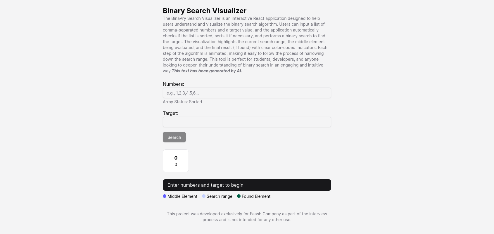

# Binary Search Visualization
The Binary Search Visualizer is an interactive React application designed to help users understand and visualize the binary search algorithm. Users can input a list of comma-separated numbers and a target value, and the application automatically checks if the list is sorted, sorts it if necessary, and performs a binary search to find the target. The visualization highlights the current search range, the middle element being evaluated, and the final result (if found) with clear color-coded indicators. Each step of the algorithm is animated, making it easy to follow the process of narrowing down the search range. This tool is perfect for students, developers, and anyone looking to deepen their understanding of binary search in an engaging and intuitive way.

## 🚀 Features  
- **Step-by-step visualization** of the binary search algorithm  
- **User input support** to test different number sequences  
- **Real-time sorting and duplicate removal** for cleaner results  
- **Interactive UI** with animations for better understanding  

## 📦 Installation & Setup  
1. Clone the project
2. Install Dependencies with `pnpm install`
3. Run(dev) or Build
   1. Build
      1. `pnpm build`
      2. `pnpm preview`
      3. Browse `http://localhost:4173` by default
   3. Run (Development)
      1. `pnpm dev`
      2. Browse `http://localhost:5173` by default
     

### ⚠️ Disclaimer  
This project was developed exclusively for Faash Company as part of the interview process and is not intended for any other use.
